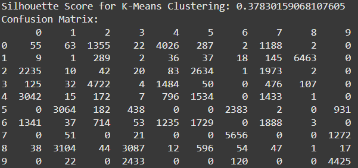

# Analysis of Fashion MNIST Dataset  

## 1. Summary and Discussion of the Data

> 📌 **Approach:** The dataset was explored structurally and statistically, normalized, and a stratified subset was created for analysis.

Fashion-MNIST contains grayscale images (28x28) of clothing articles labeled across 10 categories:

| Index | Label        |
|-------|--------------|
| 0     | T-shirt/top  |
| 1     | Trouser      |
| 2     | Pullover     |
| 3     | Dress        |
| 4     | Coat         |
| 5     | Sandal       |
| 6     | Shirt        |
| 7     | Sneaker      |
| 8     | Bag          |
| 9     | Ankle boot   |

- The dataset is balanced (6,000 samples/class)
- No missing values
- Format: `(60000, 785)` train, `(10000, 785)` test
- First column: label; rest: pixel intensities (0–255)

Pixel values were normalized to [0, 1]. A subset was created using `train_test_split` with stratification.

   
  <em>Representative examples from the dataset</em>

   
  <em>Summary statistics of the training set</em>

---

##  2. Dimensionality Reduction

> 📌 **Approach:** Applied PCA to retain 95% variance. Used cumulative sum of `explained_variance_ratio_`. Visualized 2D and 3D PCA + t-SNE projections.

### 🔷 PCA – Principal Component Analysis
- Linear method
- Retained 95% variance → 184 dimensions

### 🔸 t-SNE – t-distributed Stochastic Neighbor Embedding
- Non-linear
- Preserves local structure
- Effective on pixel-based image data

| PCA (2D) | PCA (3D) |
|---------|----------|
| 

 | 

 |

| PCA vs t-SNE (2D) | PCA vs t-SNE (3D) |
|------------------|-------------------|
| 

 | 

 |

**Conclusion:** t-SNE offered better local separation, crucial for fashion image data.
---

## 3. Clustering and Outlier Detection

> 📌 **Approach:** Three clustering methods were applied (Hierarchical, KMeans, DBSCAN). Dimensionality was reduced via PCA and t-SNE. Evaluation used four metrics (SLI, ARI, DB, CH). Parameters were selected through grid search and score ranking.

---

### 3.1 Hierarchical Clustering

> ✅ **Parameter selection:** Tested various `n_clusters ∈ [3,10]` and linkage methods (`ward`, `complete`, `average`, `single`). Best configurations selected by silhouette score.

| Reduction | Dim | Silhouette | Clusters | Linkage |
|-----------|-----|------------|----------|---------|
| PCA       | 184 | 0.1829     | 4        | Ward    |
| t-SNE     | 2   | 0.4134     | 10       | Ward    |

  
   
  <em>PCA-reduced data – 10 clusters</em>

  
   
  <em>t-SNE 2D – 10 clusters (best configuration)</em>

---

### 3.2 KMeans Clustering

> ✅ **Parameter selection:** For each dimensionality, models with `n_clusters ∈ [2,10]` were tested. Four clustering metrics were scaled and averaged. Models were ranked by dominance (top-3 in majority metrics).

| Dim | Clusters | **ARI** | **SLI** | **DB** | **CH** | ⭐ Score |
|-----|----------|---------|---------|--------|--------|----------|
| 2D (t-SNE) | 10 | **0.4266** | **0.4326** | **0.8002** | **15854** | **0.9371** |

  
   <em>KMeans on t-SNE (2D)</em>

---

### 3.3 DBSCAN

> ✅ **Parameter selection:** Performed exhaustive grid search on:
> - `eps ∈ [1.5, 3.5]` (step=0.01)
> - `min_samples ∈ [50, 100]` (step=1)  
> Best configuration selected based on silhouette score, with constraint of 3–10 clusters.

- Chosen: `eps = 3.5`, `min_samples = 58`
- Clusters: 10
- ARI = 0.4233, SLI = 0.3566
- Outliers: 522 points

  
   <em>DBSCAN clustering on t-SNE (2D)</em>

  
   <em>Detected outliers</em>

---

### 3.4 Summary of Clustering

| Method       | Best Dim | Best Score | Strength                          |
|--------------|----------|------------|-----------------------------------|
| **KMeans**   | t-SNE 2D | 0.9371     | Best clustering result overall    |
| DBSCAN       | t-SNE 2D | 0.3566     | Effective outlier detection       |
| Hierarchical | t-SNE 2D | 0.4134     | Good insight into data structure  |

⏱ **Runtime:** KMeans ~54s, Agglomerative ~3min, DBSCAN ~45min
---

## 4. Classification

> 📌 **Approach:** Used KNN and Decision Tree. Evaluated using cross-validation and confusion matrices. Models selected based on grid search over hyperparameters and multiple performance metrics (accuracy, precision, recall).

---

### 4.1 K-Nearest Neighbors (KNN)

> ✅ **Parameter selection:**  
> Tested `k ∈ [1, 20]` with three distance metrics:  
> - **Euclidean**  
> - **Manhattan**  
> - **Cosine**  
> For each configuration, predicted labels were obtained using `cross_val_predict`. Evaluation used `accuracy_score`, `precision_score`, and `recall_score`. Top models were ranked and filtered based on mean score dominance.

- Best result: `k = 4`, **Manhattan**
- Accuracy / Precision / Recall = **0.832**

  
   <em>Confusion matrix – KNN</em>

  
   <em>Mismatches in KNN</em>

344 mismatches. KNN performed well on local pixel structures. Manhattan distance worked best due to robustness to small differences in pixel intensity.

---

### 4.2 Decision Tree

> ✅ **Parameter selection:**  
> Tested tree `max_depth ∈ [2, 10]` using `DecisionTreeClassifier`.  
> Cross-validated predicted labels and calculated same metrics as for KNN.  
> Two top configurations selected based on averaged score dominance.

- Best result: `max_depth = 10`
- Accuracy = 0.768  
- Precision = 0.769  
- Recall = 0.768  

  
   <em>Confusion matrix – Decision Tree</em>

  
   <em>Tree structure (depth=10)</em>

  
   <em>Mismatches in Decision Tree</em>

469 mismatches. Decision Tree was faster and more interpretable, though slightly less accurate.

---

### 4.3 Summary of Classification

| Algorithm      | Accuracy | Precision | Recall | Time     |
|----------------|----------|-----------|--------|----------|
| **KNN**        | **0.832** | **0.832** | **0.832** | ~10 min  |
| Decision Tree  | 0.768    | 0.769     | 0.768  | ~2 min   |

---

## 🤖 5. ChatGPT’s Parallel Analysis

> 📌 **Approach:** ChatGPT performed a simplified end-to-end workflow using PCA + t-SNE for dimensionality reduction, KMeans for clustering, and Random Forest for classification.

---

### 5.1 Dataset Summary

- Merged train and test sets into one (70,000 samples)
- Flattened and normalized images
- Explored class distribution
- Did **not** check for missing values

  

---

### 5.2 Dimensionality Reduction

- Reduced to 50D with PCA, then to 2D with t-SNE
- Did **not** validate explained variance
- Dimensionality was arbitrarily chosen

  

---

### 5.3 Clustering

- Used **only** KMeans on 2D t-SNE
- Silhouette score: **0.39** (lower than manual)
- Used **confusion matrix for clustering evaluation**, which is not standard

  

---

### 5.4 Classification

- Used **Random Forest** (not used manually)
- Accuracy ≈ **0.88** – highest among all classifiers
- Provided classification report and confusion matrix

  
  

---

## 6. Conclusion

> 📌 **Summary of results from manual and automated analysis**

- **Best clustering approach:** KMeans + t-SNE (2D) – high separation and interpretability
- **Best classifier (accuracy):** Random Forest (ChatGPT, ~0.88)
- **Best manual classifier:** KNN (0.832) – good balance of precision and recall
- **Most efficient classifier:** Decision Tree (fastest runtime)
- **Best outlier detection:** DBSCAN – strong performance and clear outlier mapping
- **Best visualization:** t-SNE – preserves local neighborhood structure

---

<strong>🔗 For complete code, models, visualizations, and experimental setup, see the notebooks included in this repository.</strong>

---

